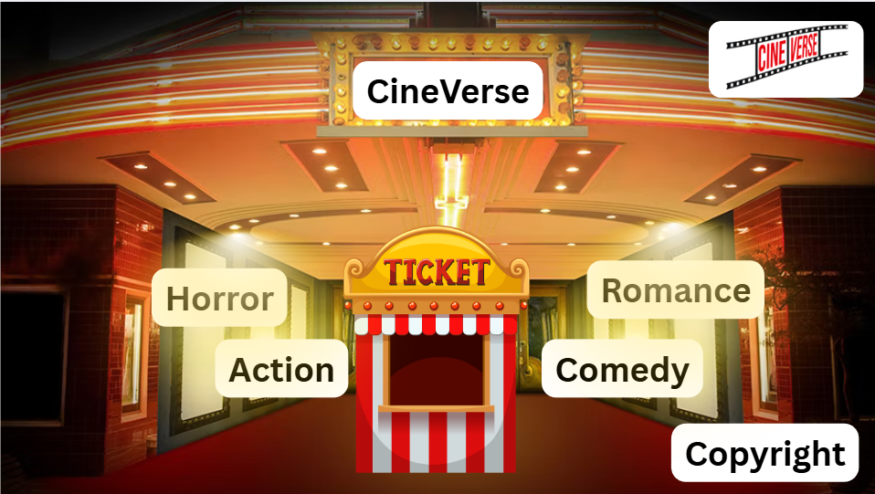
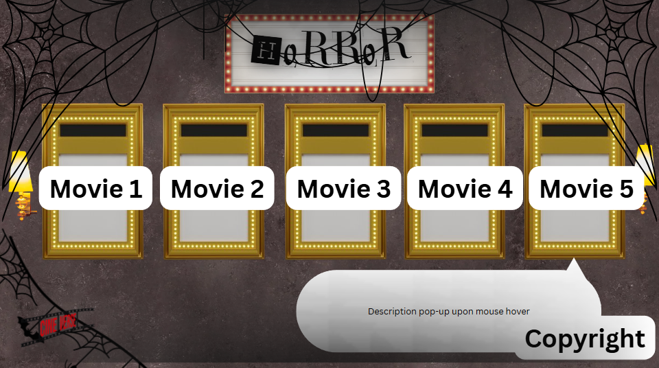
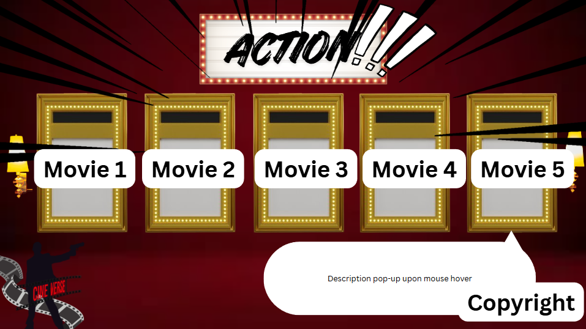
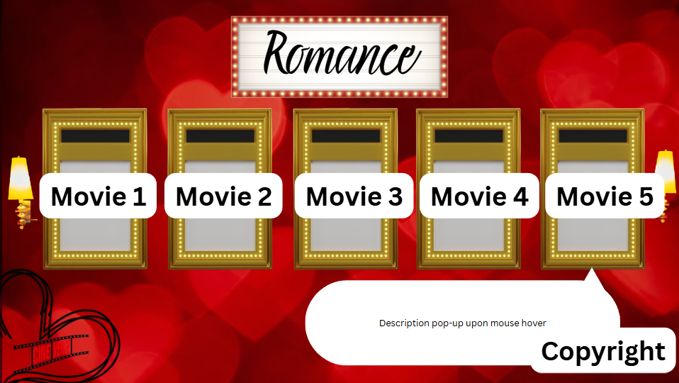
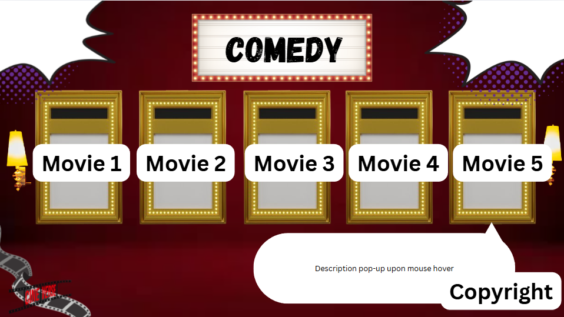
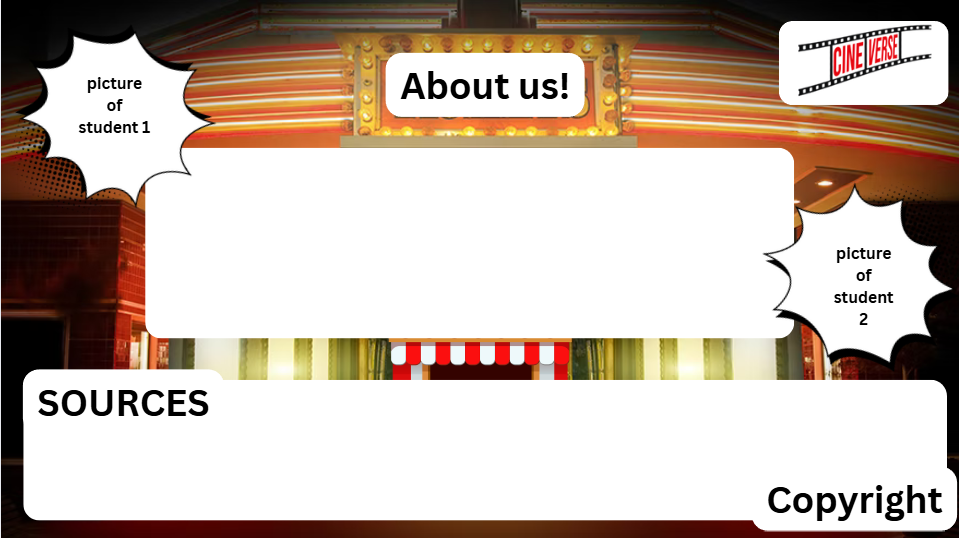

## CS Project Proposal
# CineVerse
### Personal Movie Reccomendations!

#### Logo:

#### Description
### This webpage aims to personally reccomend movies on each given genre that we found interesting and most eye catching! 

#### Webpage Breakdown
##### Homepage: The homepage will be a 90s cinema theater entrance with 4 movie posters representing each genre featured.
##### P1(Horror): This page will consist 5 different horror movies with a short desciption and a ranking based on its scare factor.
##### P2(Action): This page will consist 5 different action movies  with a short description and a ranking based on its fight scenes. 
##### P3(Romance): This page will consist 5 different romance movies  with a short description and a ranking based on its emotional impact.
##### P4(Comedy): This page will consist 5 different comedy movies with a short description and a ranking based on its humor.
##### P5(Sources and About Us): This page will be found in the homepage at the ticket booth of the cinema. It consists of all our sources at the bottom and a simple introduction.

#### Incorporation of JS
##### -Each page will expand upon mouse hover.
##### -The movie description will pop up upon mouse hover.
##### -Before a page is viewed, it'll have a glowing outline. Afterwards, it'll disapear.

#### Wireframe
##### Homepage:

##### P1:

##### P2:

##### P3:

##### P4:

##### P5
