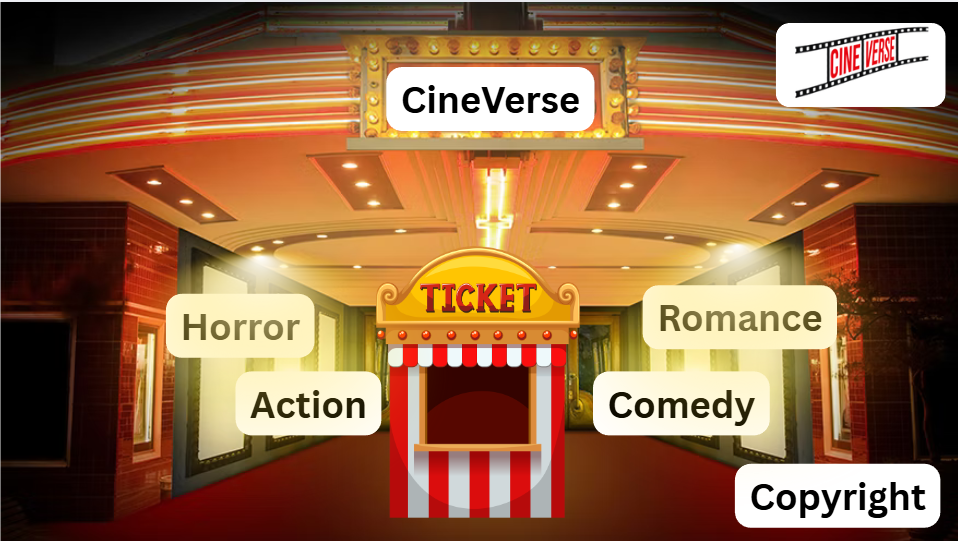
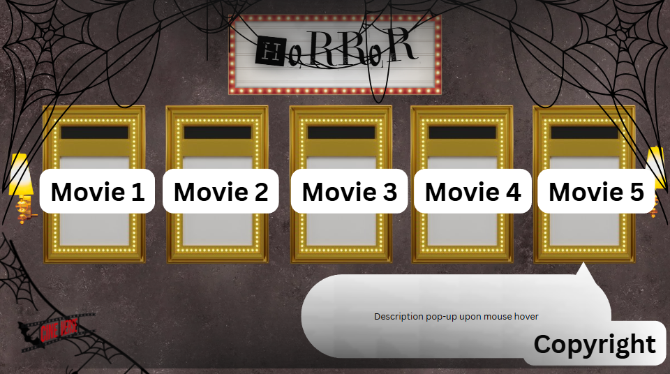
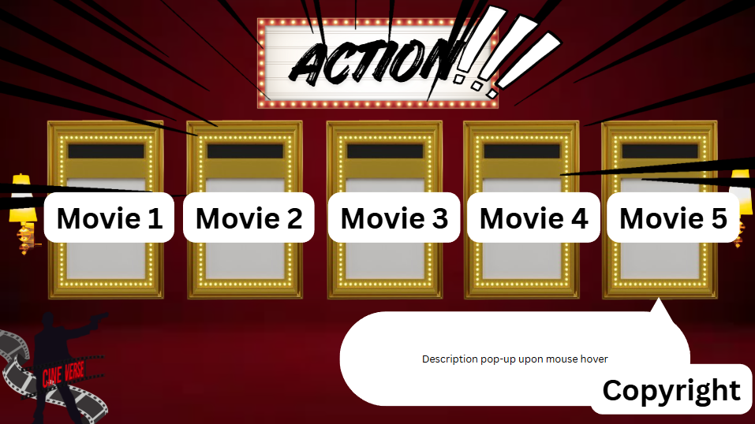
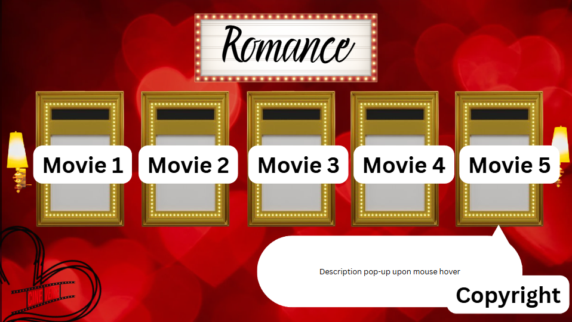
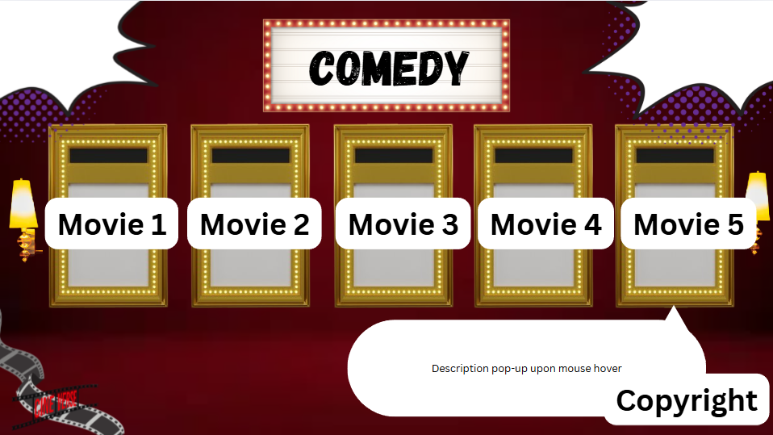
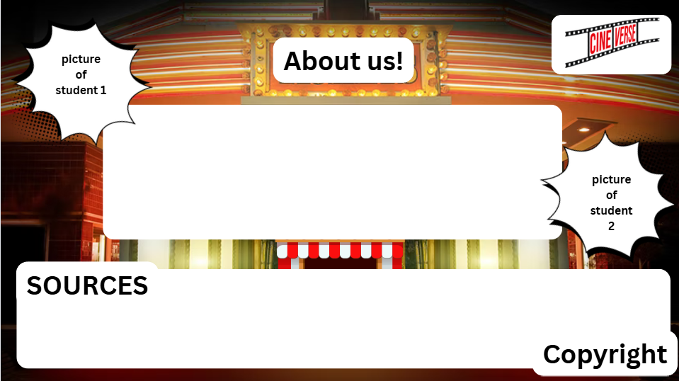

## CS Project Proposal
# CineVerse
### Personal Movie Reccomendations!

#### Description
### This webpage aims to personally reccomend movies on each given genre that we found interesting and most eye catching! 

##### This project is for movie lovers, and people who want personal movie reccomendations instead of ones off of google.This project will surely benefit them as it not only shows movie reccomendations, but also their ratings and short description of the each movie in different genres. These details highlight the personal aspect of the project as it really shows the thought and consideration put upon it.

##### Movie lovers will love this project as it has other features like user reccomendations. Movie lovers who visit our project website can also reccomend their own favourite movies in any genre, and add their own thoughts/input on that movie! Our project website is also easy to access and navigate through so even movie lovers who aren't tech savy would have no problem skimming through our website. Lastly, each genre in our project has its own design and theme. This makes it more creative and really feel like the genre itself.

##### This project does NOT include:
##### - Trailers of each movie (We'd love to add movie trailers for each movie to have more engagment with the movie we're reccomending in the future if possible)

##### - Annual Movie reccomendation updates (This would make our project be useful in the long run, but we have no recent plans on doing so. Though if ever, it won't be a difficult thing to change!)

#### Logo:

#### Webpage Breakdown
##### Homepage: The homepage will be a 90s cinema theater entrance with 4 movie posters representing each genre featured.
##### P1(Horror): This page will consist 5 different horror movies with a short desciption and a ranking based on its scare factor.
##### P2(Action): This page will consist 5 different action movies  with a short description and a ranking based on its fight scenes. 
##### P3(Romance): This page will consist 5 different romance movies  with a short description and a ranking based on its emotional impact.
##### P4(Comedy): This page will consist 5 different comedy movies with a short description and a ranking based on its humor.
##### P5(Sources and About Us): This page will be found in the homepage at the ticket booth of the cinema. It consists of all our sources at the bottom and a simple introduction.

#### Incorporation of JS
##### -Each page will expand upon mouse hover.
##### -The movie description will pop up upon mouse hover.
##### -Before a page is viewed, it'll have a glowing outline. Afterwards, it'll disapear.

#### Wireframe
##### Homepage:

##### P1(Horror):

##### P2(Action):

##### P3(Romance):

##### P4(Comedy):

##### P5(Sources and About Us):

## Final Title: CineVerse (Update!)

#### CineVerse has been upgraded with mobile compatibility, improved visuals, and new interactive pages. Users can now submit personal movie recommendations and ratings, which are then displayed in a padlet-style board for others to view.

### New Features: 
#### - Works on mobile devices
##### The site is now fully responsive, making it easy to use on phones and tablets.
#### - Takes user input 
##### A dedicated page lets users enter movie titles, recommendations, and ratings.
#####  Submitted entries appear as cards on a padlet-like board, allowing easy browsing of everyone’s suggestions.
#### - Improved visuals
##### Updated colors, fonts, and layout create a cleaner and more engaging look.

### Definition of done:
#### - All new features are done and works well.
#### - Both members of the pair are satisfied.

#### Submitted by Summer Guevarra & Sabella Alpasan on March 18, 2026 to Sir Roy Canseco in Partial fulfillment of the requirements of CS 3 of DOST-PSHS-MC.